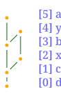

# Nadi Cairo plugin

[Cairo](https://www.cairographics.org/) is a 2D drawing library with various output formats. It is designed to be consistent across all those formats.

# History
NADI IDE was initially written using GTK3 and the network diagram was drawn using cairo, which meant you could save the exact same diagram showin in the UI element into files as well. But due to complications related to Windows operating system, IDE was rewritten in iced (a rust native cross platform library). The old code from the GTK3 interface is available as this plugin so you can still generate network diagrams.

# Installation
Follow the installation steps for a [nadi plugin](https://nadi-system.github.io/0.8.0/installation.html#nadi-plugins), which includes compiling the repository with `cargo` and copying the compiled plugin using `nadi` (which needs to be installed and inside PATH).

```bash
git clone https://github.com/Nadi-System/nadi-cairo
cd nadi-cairo
cargo build --release
nadi -i target/release/libnadi_cairo.so
```

# Example
The following code, results into the image shown below:

```task run
net.load_str("a->b\nb->c\nc->d\nx->c\ny->b\nx->y")
net.cairo.network("example.svg", label="[{INDEX}] {NAME}")
```



# Warning
1. As it was old code from the GTK version, this only works for tree graphs, not for other kinds of graph/network even if nadi officially supports any kind of directed network for analysis.
2. The reason we shifted away from GTK was because of complications with compiling for windows, as such, `nadi-cairo` is not tested in windows and mac. It works fine in Linux system with `libcairo` installed (which comes with `libgtk3`). The nadi book is also rendered in Linux, so if you want to use it on other OS, please find out how to download and compile with `cairo` C library.
